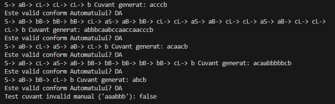

# Laboratory Work 1: Introduction to Formal Languages, Regular Grammars, and Finite Automata

**Course:** Formal Languages & Finite Automata  
**Author:** Dulgheru Ion
**Group:** FAF-241 
**Variant:** 10

---

## Theory

### Formal Language
A **Formal Language** is a set of strings of symbols that may be constrained by rules that are specific to it.

### Regular Grammar (RG)
A grammar is a 4-tuple G = (V_N, V_T, P, S), where:
- V_N is a finite set of non-terminal symbols (variables)
- V_T is a finite set of terminal symbols
- P is a set of production rules
- S is the start symbol

Regular grammars are used to **generate** strings.

### Finite Automaton (FA)
A finite automaton is a 5-tuple M = (Q, \Sigma, \delta, q_0, F), where:
- Q is a finite set of states
- \Sigma is a finite set of input symbols (alphabet)
- \delta is a transition function (Q \times \Sigma \to Q)
- q_0 is the start state
- F is the set of accept (final) states

Finite automata are used to **recognize/verify** if a string belongs to a language.

### Equivalence
There is a direct equivalence between Regular Grammars and Finite Automata. Any language generated by a Regular Grammar can be accepted by a Finite Automaton.

---

## Objectives

1. Understand what a language is and what it needs to have in order to be considered a formal one
2. Provide the initial setup for the evolving project (GitHub repo, choosing a programming language)
3. Implement a class for the Grammar:
   - Add a function to generate 5 valid strings
   - Implement functionality to convert the Grammar to a Finite Automaton
4. Implement a class for the Finite Automaton:
   - Add a method to check if an input string is valid

---

## Implementation Description

The project was implemented in **Java**.

### 1. Grammar Class (`Grammar.java`)

The grammar rules for Variant 10 were stored in a `HashMap<String, List<String>>`:
- **Key:** The non-terminal symbol (e.g., 'S', 'B')
- **Value:** A list of possible productions (e.g., "aB", "cL")

#### String Generation
To generate a string, the program:
1. Starts at 'S' and randomly selects a production rule
2. Appends the terminal character to the word
3. Updates the current state to the non-terminal character
4. Continues until a terminal-only rule (like L to b) is selected

#### Conversion to Finite Automaton
This is the core logic. The method `toFiniteAutomaton()` iterates through the grammar rules to build the transition map (\delta):
- If a rule is A to xB, it creates a transition from state A to state B via input x
- If a rule is A to x (terminal only), it creates a transition from state A to a special Final State (named "X" or "Final") via input x

```java
// Snippet from Grammar.java: Converting rules to transitions
for (String production : rules.get(state)) {
    char input = production.charAt(0);
    String nextState;
    
    if (production.length() > 1) {
        // Case: aB -> transition to B with input 'a'
        nextState = production.substring(1);
    } else {
        // Case: b -> transition to Final State with input 'b'
        nextState = "X";
    }
    
    transitions.get(state).put(input, nextState);
}
```

### 2. Finite Automaton Class (`FiniteAutomaton.java`)

This class stores:
- The transitions map
- The start state
- The final state

The method `stringBelongToLanguage(String input)`:
1. Iterates through the characters of the input string
2. Checks if a valid transition exists for the current state and current character
3. If the loop finishes and the current state is the Final State, the string is accepted

---

## Results

I executed the program to generate 5 random strings using the Grammar and then verified them using the generated Finite Automaton. I also manually tested an invalid string (`aaabbb`) to ensure the validation logic works correctly.

### Execution Output



### Analysis
The results show that every string generated by the Grammar is correctly recognized as valid ("DA") by the converted Finite Automaton, proving the conversion algorithm is correct.

---

## Conclusion

In this laboratory work, I successfully modeled a formal language using two different representations: a **Regular Grammar** and a **Finite Automaton**.

By implementing the conversion algorithm, I demonstrated that these two concepts are **equivalent** in terms of the language they define:
- The Grammar is **"generative"** (it produces strings)
- The Automaton is **"accepting"** (it verifies strings)

The project structure in Java allows for easy extension and modification of rules for future tasks.